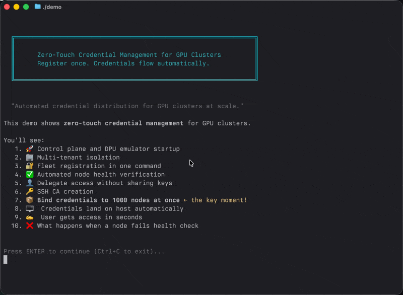

# Secure Infrastructure

**v0.6.8** | [Demo](scripts/demo) | [Quickstart](docs/guides/quickstart-emulator.md) | [Hardware Setup](docs/guides/setup-hardware.md) | [Changelog](CHANGELOG.md)



Automated credential lifecycle for AI infrastructure. No manual rotation. No secret sprawl. Credentials refresh automatically when you reimage nodes.

## Overview

Secure Infrastructure eliminates credential management overhead in GPU clusters. Push credentials once; the system handles distribution, rotation, and cleanup automatically. When you reimage a node, fresh credentials appear without tickets or manual intervention.

This works because credentials are tied to specific hardware via NVIDIA BlueField DPUs. They can't accidentally spread to other machines, so reimaging a node doesn't require hunting down credentials elsewhere. The DPU verifies host health before any credential operation, giving you automated distribution at scale.

## Features

- **Automation-ready**: Structured output (`-o json`), idempotent commands, meaningful exit codes for CI/CD
- **Zero secret sprawl**: Credentials die with the node; fresh ones created automatically on reimage
- **No network configuration**: DOCA ComCh transport uses native PCIe between host and DPU
- **SSH CA management**: Create, sign, push certificate authorities across your fleet
- **Full audit trail**: Every credential push logged with timestamp and operator identity
- **No credential drift**: Keys tied to specific hardware, can't accidentally spread to other machines
- **Health-gated operations**: Distribution proceeds only when hosts pass automatic health checks

## Quick Start

> **See it in action:** Run `./scripts/demo` to watch the full credential lifecycle in 2 minutes.

Choose your path:

| Path | Time | Requirements |
|------|------|--------------|
| [Emulator Quickstart](docs/guides/quickstart-emulator.md) | 10 min | Go 1.22+, Make |
| [Hardware Setup](docs/guides/setup-hardware.md) | 30 min | BlueField-3 DPU |

**Try the emulator first** to learn the system without hardware. The quickstart walks you through the full flow: create a tenant, register a DPU, set up operators, and push credentials automatically.

Credentials flow to verified infrastructure without manual intervention. If a node fails health checks, distribution pauses until it's healthy again.

## Installation

### macOS (Homebrew)

```bash
brew install nmelo/tap/bluectl nmelo/tap/km                    # CLI tools
brew install nmelo/tap/sentry nmelo/tap/nexus nmelo/tap/dpuemu # Agents and emulator
```

### Linux (Debian/Ubuntu)

```bash
# Add repository (auto-detects your distro)
curl -1sLf 'https://dl.cloudsmith.io/public/beyond-identity/secure-infra/cfg/setup/bash.deb.sh' | sudo bash
sudo apt update && sudo apt install bluectl km
```

### Linux (RHEL/Fedora)

```bash
# Add repository (auto-detects your distro)
curl -1sLf 'https://dl.cloudsmith.io/public/beyond-identity/secure-infra/cfg/setup/bash.rpm.sh' | sudo bash
sudo yum install bluectl km
```

### Docker

```bash
docker pull ghcr.io/gobeyondidentity/nexus:0.6.8   # Control plane
docker pull ghcr.io/gobeyondidentity/sentry:0.6.8  # Host agent
docker pull ghcr.io/gobeyondidentity/aegis:0.6.8   # DPU agent
```

For local development with Docker Compose, see [Local Dev: Docker](docs/guides/local-dev-docker.md).

### From Source

```bash
git clone git@github.com:gobeyondidentity/secure-infra.git
cd secure-infra
make
```

Check for updates anytime: `bluectl version --check`

## Documentation

### Guides

| Guide | Description |
|-------|-------------|
| [Quickstart: Emulator](docs/guides/quickstart-emulator.md) | Get started without hardware |
| [Local Dev: Docker](docs/guides/local-dev-docker.md) | Run locally with Docker Compose |
| [Hardware Setup](docs/guides/setup-hardware.md) | Deploy on BlueField-3 DPU |
| [Testing ComCh in VMs](docs/guides/testing-comch-vm.md) | Test DOCA integration without hardware |
| [Discovery](docs/guides/discovery.md) | Scan infrastructure for SSH keys |

### Reference

| Reference | Description |
|-----------|-------------|
| [Attestation Architecture](docs/reference/attestation-architecture.md) | DICE/SPDM via PSC and BMC |
| [CLI Version](docs/reference/cli-version.md) | Version check and upgrade commands |
| [Discovery Schema](docs/reference/discovery.md) | JSON output format and jq recipes |
| [Encryption Keys](docs/reference/encryption-keys.md) | Key management internals |

## Components

| Component | Package | Description |
|-----------|---------|-------------|
| `bluectl` | bluectl | Admin CLI: DPU management, tenants, operators, health checks |
| `km` | km | Operator CLI: SSH CA lifecycle, credential push |
| `agent` | aegis | DPU agent running on BlueField ARM cores |
| `host-agent` | sentry | Host agent for credential receipt via ComCh/tmfifo and posture reporting |
| `server` | nexus | Control plane server |
| `dpuemu` | - | DPU emulator for local development |
| `web/` | - | Next.js dashboard (in development) |

## Tech Stack

- **API/Agent**: Go 1.22+
- **Policy**: Cedar (AWS policy language)
- **Dashboard**: Next.js 14, Tailwind, shadcn/ui
- **Communication**: gRPC/protobuf
- **Storage**: SQLite (encrypted)

## Development

```bash
# Build all binaries
make

# Run tests
make test

# Build release binaries for all platforms
make release

# Dashboard
cd web && npm install && npm run dev
```

## Project Structure

```
secure-infra/
├── cmd/           # CLI and agent entrypoints
├── pkg/           # Shared libraries
├── internal/      # Private application code
├── proto/         # Protobuf definitions
├── gen/           # Generated gRPC code
├── dpuemu/        # DPU emulator
├── web/           # Dashboard (Next.js)
├── deploy/        # Install scripts
└── docs/          # Setup guides
```

## License

Licensed under the Apache License, Version 2.0. See [LICENSE](LICENSE) for details.

Copyright 2024-2026 Beyond Identity, Inc.
